build-lists: true
footer: 0 to API in node.js, @jonmadison, Seattle Code Camp 2015
slidenumbers: true

# [fit] 0 to API in node.js

^(tell story of how harry hit you up about presenting and how your talk was accepted and how you had to turn these notes into a talk, lol) 

^I've spent a bit of time pairing with devs showing them node.js. Think of this as sitting and pairing with me as we start a node API. with lots of other people pairing, and you not getting to type at all.

^before the talk:

^turn on Do Not Disturb

^start up stickies

^restore window arrangement: 0toAPI

^sudo su - jon -c  'postgres -D /usr/local/var/postgres'

^cd ~/presentations/0toAPI/ft

^subl .

---

#key takeaways

- API first
- design APIs using tests. 
- look into node if you haven't

^0:01

^[CLICK] when starting a new web based project, consider starting with the API first. I mean this is obviously after you've come up with the idea, and have some inkling of how the thing will look. This talk is more about how you start once you've firmly determined what you want.

^[CLICK] when designing your API, use tests. go ahead and write the code.

^[CLICK] consider node, to help you move fast on your journey.

---

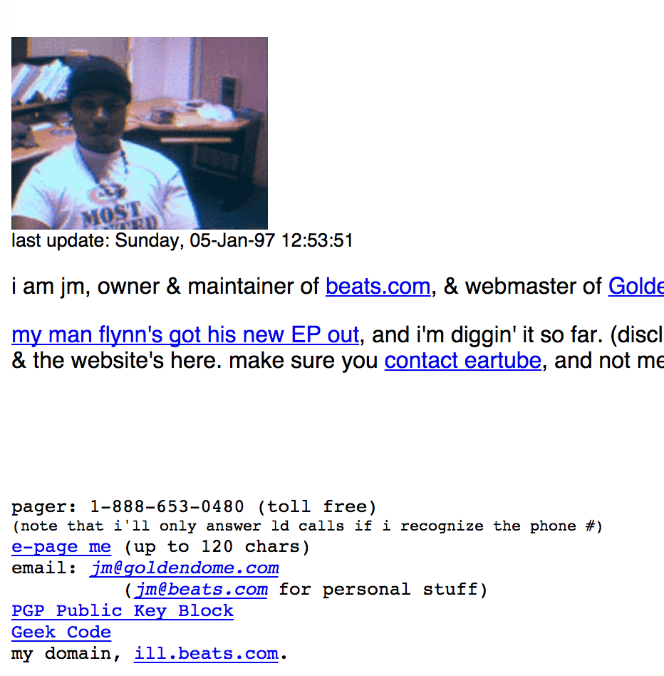

---
 

---
 

   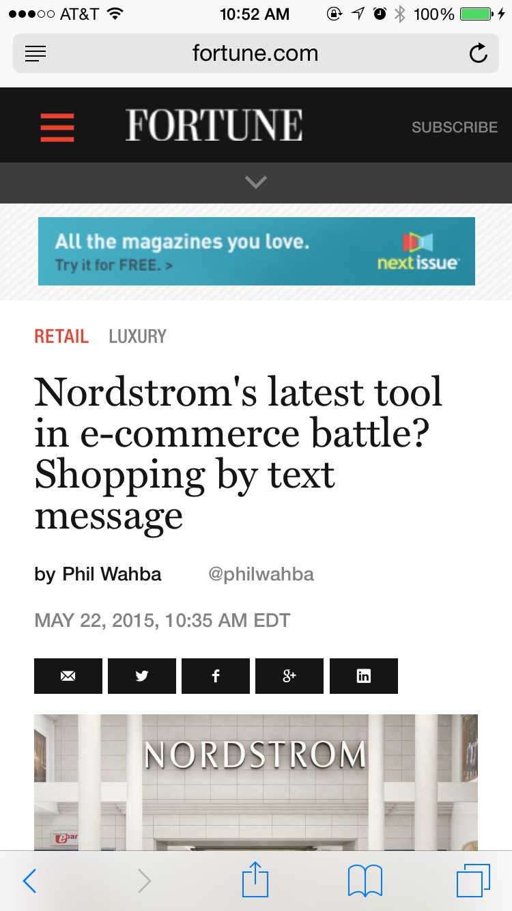


^0:02

^I'm a full stack application developer currently at Nordstrom on the Customer Mobile team. I work on a great product called Next, which is used by our Salespeople to deliver customer experience via text messaging. Textstyle is a feature that lets customers make purchases using their SMS client.

---

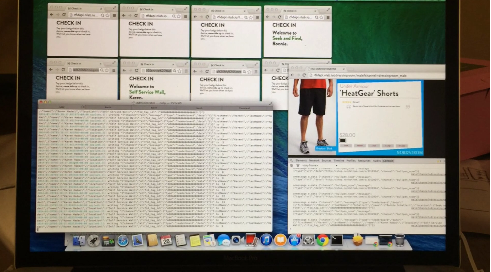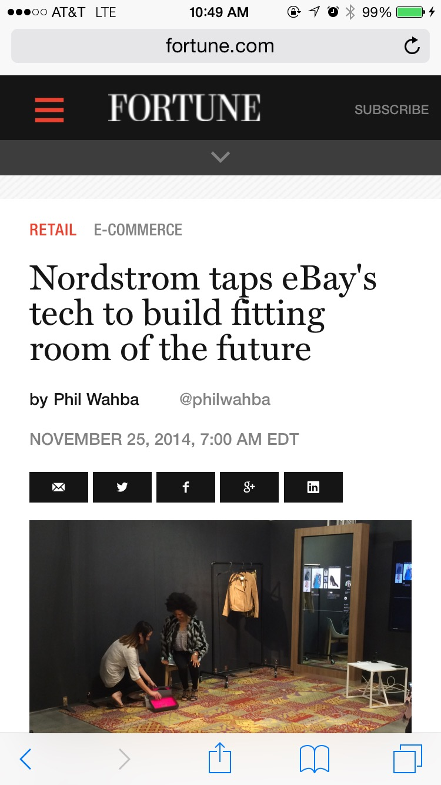

^0:02

^For the past few years i've worked on several customer experiences in store, and in our test store, as much as possible using an API first approach.

^I've been doing web work for a while now in varying capacities, all technical, whether it be engineer, onsultant, or application architect. On the web front, here are the technologies & frameworks i've spent most of my time in

---
 

---
 

---
  

---
  
 

---
  
 

---


---
#[fit]Why API, first?


^0:04

^ how many front end devs here?
^ how many back end, or full stack folk?
^ how many of you have worked with an API? either using or worked on one?
^ anybody written them from scratch?

^Why focus on APIs (or, Interfaces) first? well let's look at what i'm talking about here. 

^I'm not saying anything new, and for anyone new to the field, this kinda thing is pretty much the same thing we computer people talk about over and over: how to reduce dependencies between pieces of code, and groups of pieces of code, etc...

---
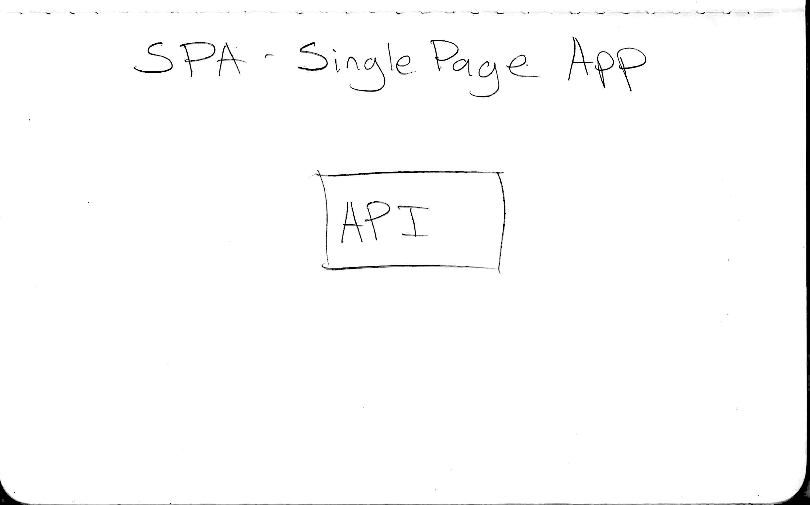

^0:05

^Since this talk is about API-first, i'll start with this API box, first.

---
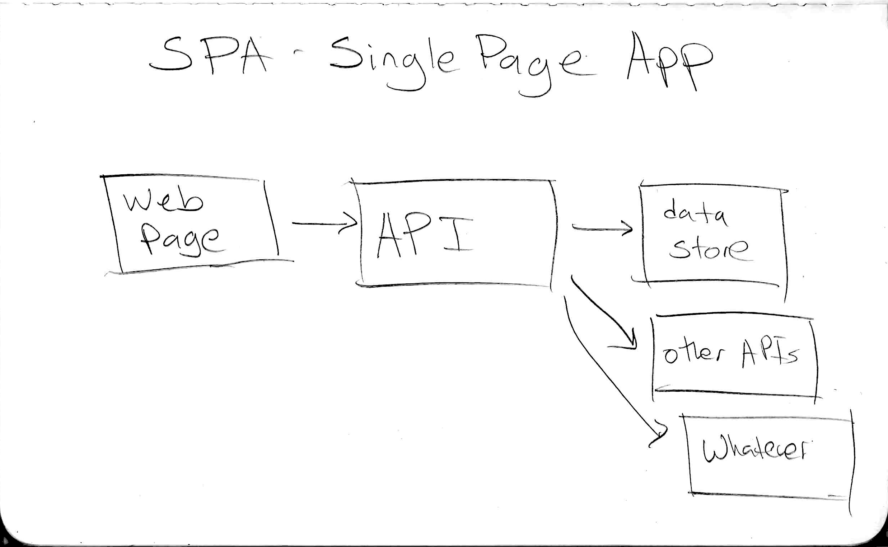

^Which interacts with a data store, maybe even other APIs, or whatever.

^And a traditional SPA, the web app connects to an API, many times deployed on the same server, but usually once you scale, across machines but maybe in the same domain...

---
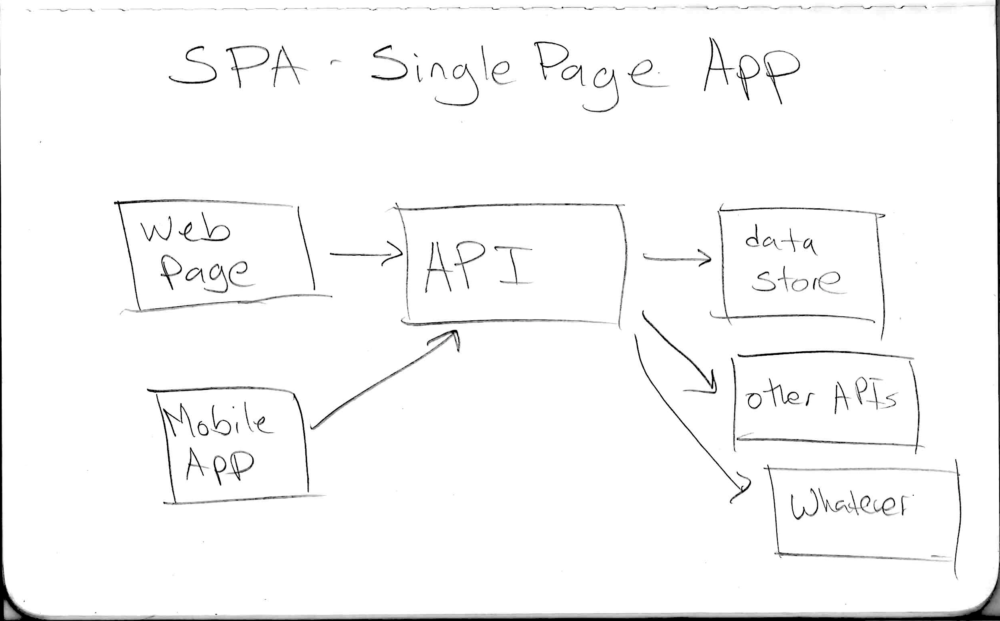

^When you think API first, then when it's time to write your mobile app, you can use the same guts to drive the thing, but perhaps put a view (or view model) to interact with the API

---
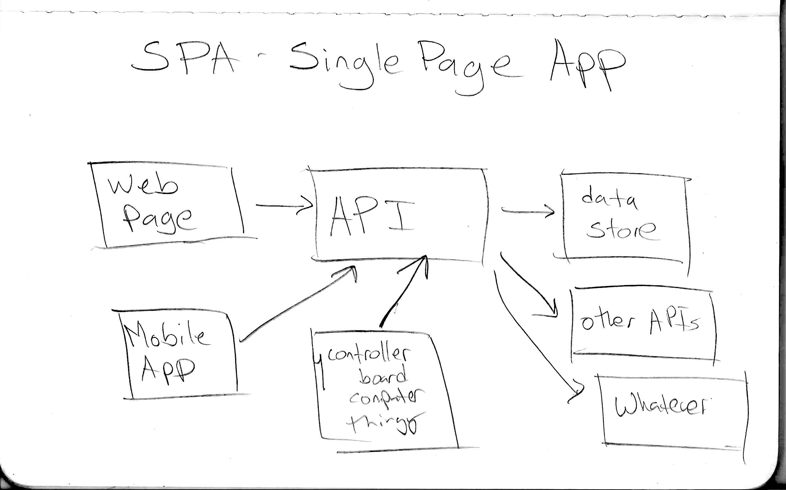

^And hey, maybe you have an Edison board or Raspberry Pi that wants to use the API. it can play too! as well as other whatevers

---
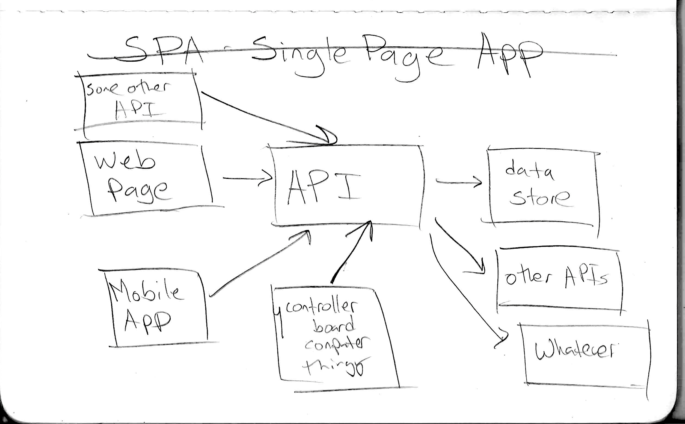

^Oh yeah, we're no longer talking about just a SPA, because your API at the hub is now enabling all sorts of other things you hadn't thought about. Or at least that's the idea. For this talk, trust me on that. :)

---
#Why node.js?


- minimal
- powerful
- additive, not subtractive (most of the time)
- it's javascript, with all its quirkiness

^0:07

^how many of you know what node.js is? (hopefully everyone)

^While in the Innovation Lab at Nordstrom, i was introduced to node.js after a few RoR deployments. I enjoyed Rails, but found that it gives me much to work with when i use its generators. I'd find myself having to understand what and what i didn't need for a project.

^[CLICK] node has a kind of unix shell philosophy--it allows you to add modules as you need them, and you're encouraged to make your own modules small. Substack -- 782 repos last count. that's one (well, very productive) developer!

^[CLICK] it's powerful. it's minimal enough to run on a micro computer (Raspberry Pi, Edison) but allow you to do some really cool stuff within that small footprint.

^[CLICK] I happen to enjoy javascript. It's quirky, and i like quirky. It can be lovely when used properly. and with enhancements to the language, it's only going to get better.

---

#Let's start with an idea

You have an idea, or job to be done

- data you want available to a mobile or web site or app?
- gather data from multiple clients (signing up customers? weather sensor?)
- mashing up multiple APIs

^0:09

---

#Today's idea - flowers!
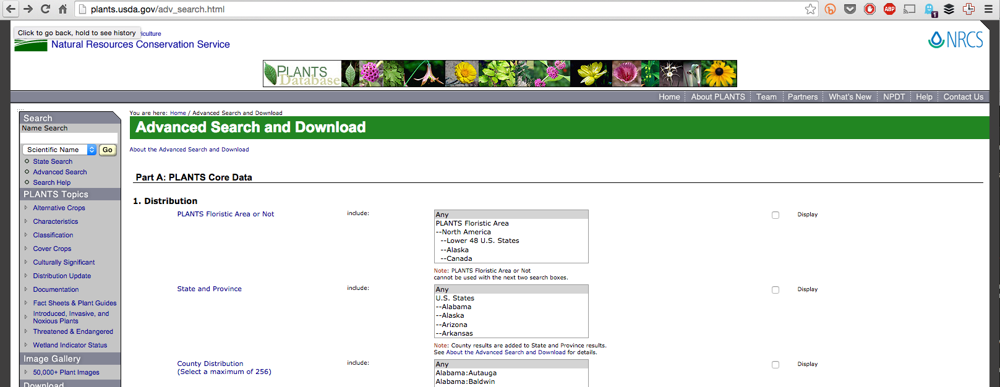

^0:10
I had a concept a few years back called "flower thing", which was supposed to be a site to help people envision, create, and share flower garden ideas and the like. 

^It had a component where you could research viable flowers in your locale. To feed this, i took data from a government db of flowers http://plants.usda.gov/java/. it's pretty much a PITA to get the data from this database http://plants.usda.gov/adv_search.html. 

^At the time, I re-exposed this info to my rails web app. What i’d like to do is take this data instead and expose it as a pure API, so i can write both a web and mobile app quickly. Again, this isn't something you can't do with rails, but i can move faster doing this in node, and still have a handle on the code that i've written.  

---


  
 

^0:12

^How many here have used express? 

^I won't get into details about express, just enough to work through the examples. The express website explains it well: it's a "Fast, unopinionated, minimalist web framework for Node.js". it's middleware-based. its "app.use" construct is kinda like a Pipeline pattern, where you can plug in modules that are a part of the request process.

^[SLIDE] mocha is a test framework for javascript. There are others, and I encourage you to find one that suits your needs. Mocha suits mine.

^js-must: There are several assertion libraries--i think should is one of the most popular, but i recently came across must and i'm sold, as it seems to fix a few gotchas with the should library. Chai is also a popular expectations library, that claims to get you closer to BDD.

---
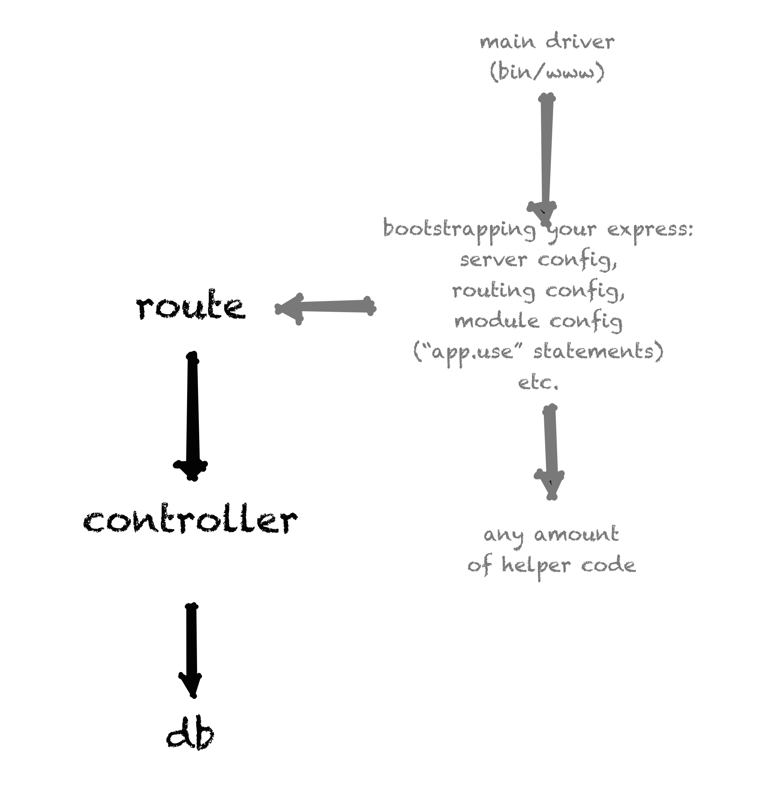

^0:13

^Here's how the code is laid out, in a nutshell

^after the app is bootstrapped, a router is exposed that can take requests, and pass them to a controller to fetch data from the db.

---
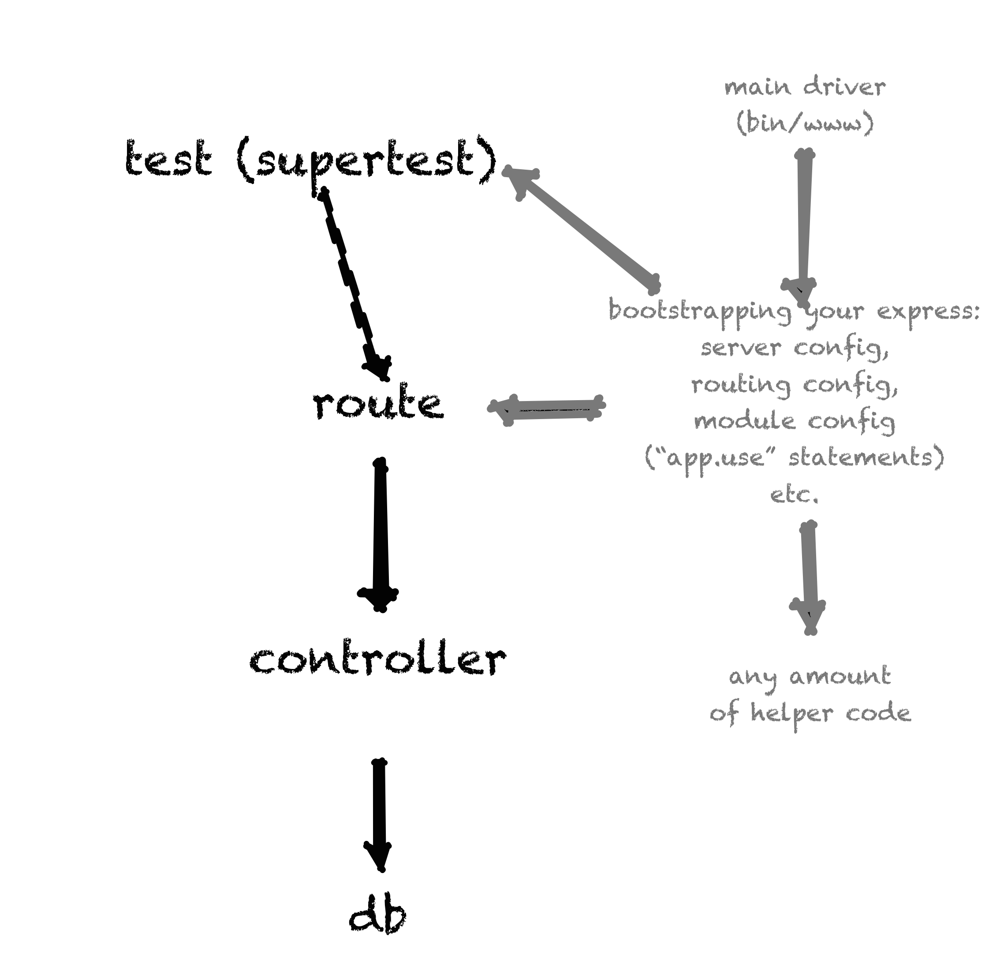

^we'll use supertest to spin up our express server and make API calls. They're gonna fail first, then we'll write the functionality.

---
#Create the project

```bash
% sudo npm install -g nodemon             #automatically restarts our server
% sudo npm install -g express-generator   #quickly gets us started. could use "npm init" but we're pressed for time
% express ft --git                        #create 'scaffolding' for our project with git ignore file
% cd ft                                   #get in there...
[get rid of 💩]
```

^0:16

^Now that we have that out of the way, let's get some stuff installed that'll help us along

^Thing is, express-generator is okay, but it assumes that you're building an entire website. It gives us a little too much (not as much as rails however ;-) so there's cruft to remove in the directory structures, and the app driver. I detail that in the github repo notes.

---

#About REST
- Google "Roy Fielding Chapter 5"
- an *architectural style* 
- Resources are nouns, Operations are verbs
- discoverable endpoints
- be consistent

^0:18
^How many of you know REST
^ [CLICK] Roy fielding first proposed it, ch. 5 is the canon
^ [CLICK] it's an architectural style that defines constraints around how resources on a web server are accessed
^ [CLICK] Resources are nouns, Operations are verbs (GET/POST/PUT/PATCH/DELETE). We'll get to that in a sec
^ [CLICK] you want the URLs to be discoverable (guessable without a lot of mind-bending)
^ [CLICK] some operations should be idempotent -- the result of a successful performed request is independent of the number of times it is executed
^ [CLICK] just try to be as common sense and consistent as possible. 

^let's see an example of a resource, in a common data format, JSON.

---


#A Resource in JSON
```javascript
{
  id: 7275,
  name: "'oha kepau",
  description: "this ",
  create_dt: null,
  user_id: null,
  zones: "10a,11",
  created_at: "2015-09-07T13:49:38.988Z",
  updated_at: "2015-09-07T13:49:38.988Z",
  color: "",
  color_family: "purple",
  states: "USA (HI)",
  growth_season: "fall",
  shopping_list_id: null,
  garden_id: null,
  duration: "Perennial",
  scientific_name: "Clermontia hawaiiensis",
  foliage_color: "green",
  seed_color: null,
  fruit_color: "violet",
  shade_tolerance: "full sun"
}
```
^0:18

^Before designing the API, it helps to design a resource, using code. in this case, we're using JSON to describe how a plant should "look".

---


```javascript
{
  plants: [
  {
    id: 3849,
    name: "'ahakea",
    description: null,
    create_dt: null,
    user_id: null,
    zones: null,
    created_at: "2015-09-07T13:49:29.288Z",
    updated_at: "2015-09-07T13:49:29.288Z",
    color: "",
    color_family: null,
    states: "USA (HI)",
    growth_season: "",
    shopping_list_id: null,
    garden_id: null,
    duration: "Perennial",
    scientific_name: "Bobea timonioides",
    foliage_color: "",
    seed_color: null,
    fruit_color: "",
    shade_tolerance: null
  },
  {
    id: 3847,
    name: "'ahakea lau nui",
    description: null,
    create_dt: null,
    user_id: null,
  [...]
```

^Here's how I decided to show a list of plants for now. IRL i'd probably have some meta info like pagination info, number of total results or somesuch, etc.

^How should we ask for this resource? using HTTP verbs, in this case specifically GET.

---


#Endpoints
  ```
  GET /plants                  
  #verb: GET noun: plants -- get a list of plants

  GET /plants/:id             
  #verb: GET noun/resource: a specific plant with id

  GET /plants?name=<term>    
  #verb: GET noun: a plant whose "name" matches the <term>

  POST /plants        
  #verb/op: POST noun/resource(bucket): plants -- add a new plant
 
  PATCH /plants/:id
  #verb/op: PATCH noun/resource(bucket): plants -- update a specific plant

 [...]
 ```

^0:20

---


^0:24
^Now, let's get into writing tests to make these designs come true.

---

#Hello world of tests, i guess

```javascript
describe('basics',function(){
     it('should return 404 on /',function(done){
          request(app)
          .get('/')
          .set('Accept','application/json')
          .expect(404,done);
     })
});
```

^0:24

---

#Time for a real test - one assertion style

```javascript
  it('should return a list of plants',function(done) {
      request(app)                                    // create a new HTTP request...
      .get('/v1/plants')                              // of type GET /v1/plants
      .set('Accept', 'application/json')              // set Accept header to ask for json response
      .expect('Content-Type',/json/)                  // content type header should be json
      .expect(200, function(err,res) {                // need status 200 OK, and the following...
        demand(err).be.empty();
        demand(res.body).not.be.empty();
        demand(res.body.plants.length).equal(100);
        
        //get an example record
        var firstPlant = res.body.plants[0];
        demand(firstPlant).not.be.empty();
        demand(firstPlant.name).not.be.empty();
        demand(firstPlant.scientific_name).not.be.empty();
        done();
      })
    });
```

^0:26

^[SUBLIME TEXT] 1-test tab

^There are a few ways we could do the assertion. The "demand" style seems to lend itself more to BDD.

^[SUBLIME TEXT] rouotes/plants.js, 1-route tab

^[SUBLIME TEXT] controllers/plants.js, 1-impl tab

^now let's run this test.

^mocha test

---

#Expect a specific result, use our JSON design

```javascript
it('should return a particular plant',function(done){
    request(app)                                         // create a new HTTP request...
    .get('/v1/plants/17590')                             // endpoint for single plant, very RESTful, yes
    .set('Accept', 'application/json')                   // i want JSON back
    .expect('Content-Type',/json/)                       // so i should get JSON back
    .expect(200, {                                       // check it: i can check for an entire object!
                    name: 'Agardh lupine',
                    id: 17590,                         
                    description: null,
                    create_dt: null,
                    user_id: null,
                    zones: null,
                    created_at: '2015-09-07T13:50:06.654Z',
                    updated_at: '2015-09-07T13:50:06.654Z',
                    color: '',
                    color_family: null,
                    states: 'USA (CA)',
                    growth_season: '',
                    shopping_list_id: null,
                    garden_id: null,
                    duration: 'Annual',
                    scientific_name: 'Lupinus agardhianus',
                    foliage_color: '',
                    seed_color: null,
                    fruit_color: '',
                    shade_tolerance: null },done);
 });
```

^0:29

^[SUBLIME TEXT] 2-test tab

^Say you already had your desired data stubbed out (you used json-generator or some such), you can directly use them in your expectations like so

^[SUBLIME TEXT] routes/plants.js 2-route tab

^[SUBLIME TEXT] controllers/plants.js 2-impl tab

---
#Support querying

```javascript
     it('should return a particular plant via query',function(done){
          request(app)
          .get('/v1/plants/?name=Agardh%20lupine')
          .set('Accept', 'application/json')
          .expect('Content-Type',/json/)
          .expect(200, {    id: 17590,
                           name: 'Agardh lupine',
                           description: null,
                           create_dt: null,
                           user_id: null,
                           zones: null,
                           created_at: '2015-09-07T13:50:06.654Z',
                           updated_at: '2015-09-07T13:50:06.654Z',
                           color: '',
                           color_family: null,
                           states: 'USA (CA)',
                           growth_season: '',
                           shopping_list_id: null,
                           garden_id: null,
                           duration: 'Annual',
                           scientific_name: 'Lupinus agardhianus',
                           foliage_color: '',
                           seed_color: null,
                           fruit_color: '',
                           shade_tolerance: null },done);
     });

```

^0:33

^[SUBLIME TEXT] 3-test tab

^Say you already had your desired data stubbed out (you used json-generator or some such), you can directly use them in your expectations like so

^[SUBLIME TEXT] controllers/plants.js 2-refactor tab

^We'll stop here. In a fleshed out API, we'd handle pagination, have more search options, etc. as needed. Let's get this pushed to the Nets!

---

#deploy to the Internet!

```bash
% heroku login
% heroku create ftapi-ex
% heroku addons:create heroku-postgresql
% vi .gitignore
% git add .
% git commit -am"net push"
% git push heroku master
```

^0:37

^heroku create -- will create your app. Take a look -- you're live! well, your site is at least. We need to do a little more configuration to get up and running.

^we'll need to add the postgres Haddon.

^edit your .gitignore to include node_modules/

^commit, and push. it really is like magic...heroku recognizes that you're building a node app--our app already is looking for the DATABASE_URL variable 

---

#[fit]example client: iOS


^0:38

^I built an example iOS app that will let you see the list of plants, and get details on a single one. It took less than an hour to throw together. And yes, it looks like it. sorrry!


---
#Security considerations
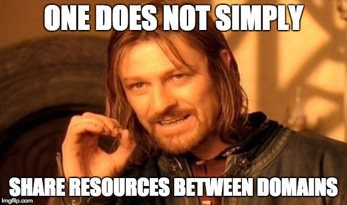

- CORS + jsonp

^0:45

^ [SLIDE] Browsers generally have a "Same Origin Policy" -- you can't share your API with web apps that are hosted outside of yours. 

^ 2 ways to do this: CORS, and jsonp. CORS is "Cross Origin Resource Sharing" and was made to solve just this problem.JSONP is a widely used hack that essentially wraps a script in the result that you evaluate. sounds weird and i won't get into it here (mainly because it kinda makes me mad 'cos i don't like hacks like that :-)


---
#Security considerations
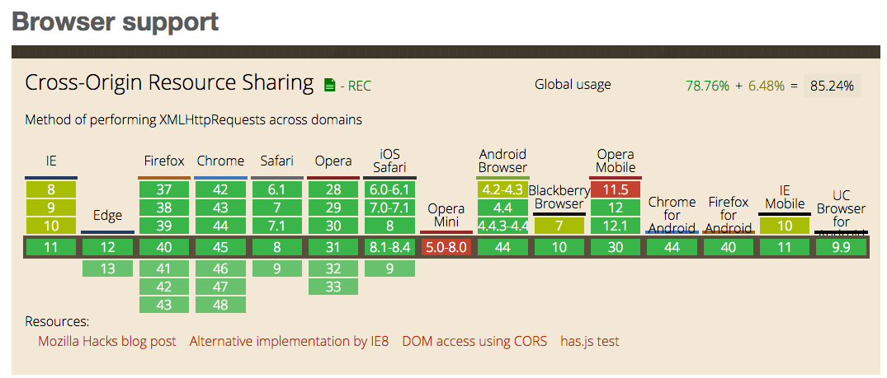

^IMO CORS is better, but not 100% supported.

---
#Security considerations


- CORS + jsonp
- Secure your endpoints using PassportJS 
     - passport-local + passport-http-bearer
     - jwt-simple
     - Sign your Tokens
- use HTTPS on the Internet, always.

^0:45

^ [SLIDE] Browsers generally have a "Same Origin Policy" -- you can't share your API with web apps that are hosted outside of yours. 

^ 2 ways to do this: CORS, and jsonp. CORS is less hacky, but also doesn't have 100% browser support. JSONP is a standard hack that 

^ [SLIDE] PassportJS is an great middleware for providing authentication, and comes with dozens of strategies (ways to authenticate). 

^ I manage a secret key in my apps that i use to sign my tokens. Using heroku it's easy to rotate this key (though you'd have to invalidate sessions)

^ [SLIDE] Unfortunately I don't have time to walk through the configuration of PassportJS in your app; There's enough info for it's own talk.

^ There are a whole host of security considerations you should be familiar with, depending on the fidelity of what you're building.

---

#Summary

- API first
- design APIs using tests. 
- node is neat.

^ [CLICK]
^ [CLICK]
^ [CLICK] I hope you found node as interesting as i think it is for solving this set of problems.

^0:48

---


[Web API Design: Crafting Interfaces that Developers Love (PDF)](https://pages.apigee.com/rs/apigee/images/api-design-ebook-2012-03.pdf)

[The World's Most Misunderstood Programming Language](http://www.crockford.com/javascript/javascript.html)

[Javascript: Understanding the weird parts](https://www.udemy.com/understand-javascript/)

[ExpressJS crash course from StrongLoop](https://www.youtube.com/watch?v=aHqnFWLP7wA)

[Token Authentication and Single Page Apps](https://stormpath.com/blog/token-auth-spa/)

^I can't stress this enough--if you're working in JavaScript, take some time to really get to know it. the "Understanding the weird parts" talk is one of the best resources i've found thus far on the subject. One of the best $32 you'll spend as a developer.

---

#Related Code Camp sessions
[11:00 AM-12:00 PM TDD with TypeScript, AngularJS and Node.js](https://seattle.codecamp.us/Session/Details/12)

[2:15 PM-3:15 PM Building Modern Web Front Ends on AWS, Linux and ReactJS](https://seattle.codecamp.us/Session/Details/24)

[3:30 PM-4:30 PM Testing Node APIs With Mocha and SuperTest](https://seattle.codecamp.us/Session/Details/71)

---
#Questions?
#@jonmadison, http://www.jonmadison.com
#me@jonmadison.com
#jon madison on most of the things

